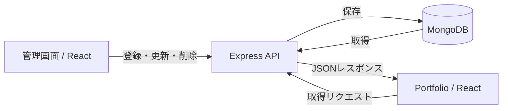

# ss-list — 開発者ポートフォリオとWebアプリケーション

## 概要

React・Express・MongoDBを用いて、画面からAPI・データベースまで実装した個人開発プロジェクトです。初期画面は開発者ポートフォリオで、自己紹介・スキル・プロジェクト・学習履歴・連絡先を表示します。
ポートフォリオの主要コンテンツはMongoDBで管理し、管理画面から登録・編集できるように実装しています。タスク管理や文章の差分表示などのWebアプリケーションも同じプロジェクトに含まれています。

本プロジェクトは、過去に個人開発として作成したWebアプリケーションをベースに、現在もポートフォリオとして整理・改善を進めています。以下では現在実装している機能を紹介し、今後取り組む内容は末尾の「今後の改善」にまとめています。

## 主な機能

| 機能 | 内容 |
| --- | --- |
| Portfolio | `/` でポートフォリオを表示。主要コンテンツはAPIから取得 |
| Admin / Content Management | `/ssPortfolio/admin` で紹介文の編集やプロジェクト・学習履歴の登録・更新・削除 |
| Additional Applications | SSList、SSDiary、SSMemory、SSColorを個別の画面として提供 |

## コンテンツ管理

管理対象の内容は、ソースコードの変更や再デプロイを行わずに更新できます。対応範囲は以下のとおりです。

| コンテンツ | Create（登録） | Read（閲覧） | Update（更新） | Delete（削除） |
| --- | :---: | :---: | :---: | :---: |
| Team Projects | ○ | ○ | ○ | ○ |
| Personal Projects | ○ | ○ | ○ | ○ |
| Courses | ○ | ○ | ○ | ○ |
| Intro | — | ○ | ○ | — |
| About / Skills | — | ○ | ○ | — |
| Contact | — | ○ | ○ | — |

管理画面から送信した内容をExpress API経由でMongoDBに保存します。公開側のPortfolioはAPIからデータを取得し、各セクションに表示します。SkillsはAboutの一部として編集します。



## その他のアプリケーション

### SSList

日付・完了状態・優先順位を考慮したタスク管理アプリです。タスクの登録・編集・削除と完了チェックに対応し、MongoDBに保存します。選択日までに作成されたタスクを対象に、選択日より前に完了したものを除外し、優先順位で並べて表示します。

### SSDiary

文章の原文と修正文を保存し、`react-diff-viewer`で単語単位の差分を表示するアプリです。文章の登録・編集・削除と、スクロールに応じた追加読み込みを実装しています。

### SSMemory

表示されたマスの位置を覚えて選択するメモリーゲームです。ラウンド進行、盤面サイズによる難易度の変化、正誤判定、再スタートをReactで実装しています。

### SSColor

色鉛筆を並べたUIをドラッグで回転させ、選択した色をSVGに反映するインタラクションの実装例です。Framer Motionを使用しています。

## 使用技術

| 分類 | 技術 |
| --- | --- |
| Frontend | React、JavaScript、Redux Toolkit、React Redux、React Router |
| スタイル・アニメーション | Tailwind CSS、Framer Motion |
| アプリ内の処理 | date-fns（日付処理）、react-diff-viewer（文章比較）、react-waypoint（追加読み込みの検知） |
| Backend | Node.js、Express |
| Database | MongoDB、MongoDB Node.js Driver |

## アーキテクチャ

Reactの画面からExpressのHTTP APIを呼び出し、サーバー側でMongoDBのデータを取得・更新する構成です。Portfolio・SSList・SSDiaryは同じExpressサーバーを利用し、SSMemory・SSColorはブラウザー側で動作します。

```text
React → Express API → MongoDB
```

| API | 用途 | MongoDBコレクション |
| --- | --- | --- |
| `/api/ssportfolio` | ポートフォリオの取得・管理 | `ssportfolio` |
| `/api/sslist` | タスク管理 | `sslist` |
| `/api/ssdiary` | 原文・修正文の管理 | `ssdiary` |

```text
client/src/
  pages/        各アプリの画面、Portfolioの公開画面・管理画面
  components/   UIコンポーネント
  redux/        Portfolioの状態管理
routes/         機能別のExpress API
db/             MongoDB接続
index.js        Expressサーバーの起動・ルーティング
```

## 実装のポイント

- **画面からDBまでの接続**：Reactの入力フォーム、Express API、MongoDBの保存・取得処理を実装しました。
- **ポートフォリオのデータ管理**：主要コンテンツをMongoDBに保存し、`category`ごとに公開画面の表示を分けています。
- **管理画面**：プロジェクト・学習履歴のCRUDと、自己紹介・スキル・連絡先の編集画面を用意しています。
- **Redux Toolkit**：APIから取得したPortfolioデータとローディング状態を管理し、各セクションで共有しています。
- **SSListの表示条件**：日付・完了状態による絞り込みと、優先順位による並べ替えを組み合わせています。
- **SSDiaryの文章比較**：保存した原文・修正文を差分表示ライブラリに渡し、変更箇所を確認できるようにしています。

## Screenshots

画面キャプチャは後日追加予定です。

- [ ] Portfolio Main
- [ ] Admin / Project Edit
- [ ] SSList
- [ ] SSDiary

## ローカル開発

以下はリポジトリの設定に基づく手順です。クリーン環境でのインストール・起動・ビルドは未検証です。Reactと`react-diff-viewer`のpeer dependency範囲に不一致があるため、依存関係のインストールに調整が必要になる場合があります。

### 前提

- Node.js・npmと、接続可能なMongoDBが必要です。ルートの`package.json`にはNode.js `16.15.0` / npm `8.5.5`が指定されていますが、動作保証や推奨バージョンを示すものではありません。
- サーバーはルートの`config.env`を読み込みます。`ATLAS_URI`はMongoDB接続先、`PORT`はサーバーのポート設定です。接続情報の実値はここには掲載しません。
- 使用するDB名は`sslist`です。Portfolioの表示には`ssportfolio`コレクションのデータが必要です。
- 自動初期化スクリプトはありません。`initialData.js`は実行可能なseedではなく、空のDBからそのまま画面を構築できる手順は未整備です。Intro・About・Contactの編集も既存データを前提としています。

### 依存関係のインストール

リポジトリのルートで実行します。

```sh
npm install
cd client
npm install
cd ..
```

### 開発サーバー

ルートで次のコマンドを実行すると、BackendとFrontendを同時に起動します。

```sh
npm run dev
```

Frontendの標準URLは`http://localhost:3000`です。clientのproxyは`http://localhost:5000`を参照します。Backendのポートを変更する場合はproxyとの整合が必要です。

個別に起動するスクリプトもあります。

| 実行場所 | コマンド | 内容 |
| --- | --- | --- |
| ルート | `npm run dev:server` | nodemonでBackendを起動 |
| ルート | `npm run dev:client` | Frontendの開発サーバーを起動 |
| `client/` | `npm run build` | Frontendのビルド |

## 今後の改善

既存の機能を活かしながら、以下の改善を段階的に進める予定です。

- 画面キャプチャを追加し、各機能の操作例を充実させる。
- 依存関係の互換性を確認し、ローカル開発手順とサンプルデータの準備方法を整備する。
- 入力チェックや通信エラー時の案内、データがない場合の表示を改善する。
- 管理画面での保存後のデータ再取得と表示の整合性を改善する。
- コンテンツ管理や各アプリの主要操作を対象に、テストを整備する。
